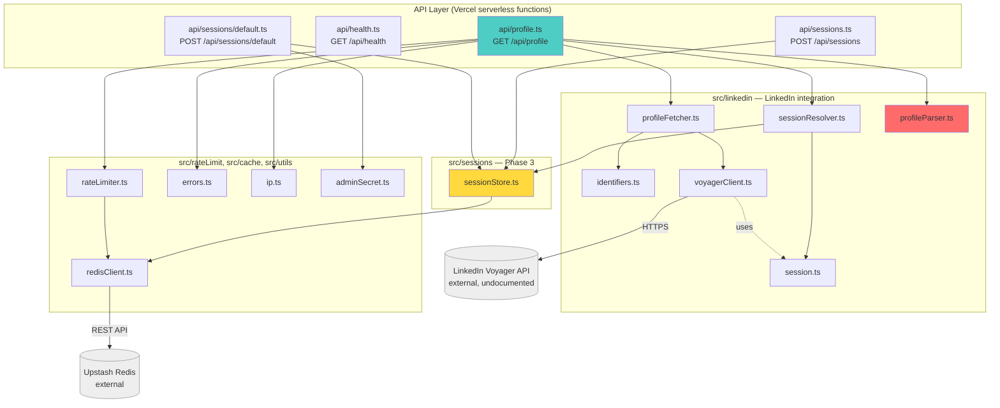
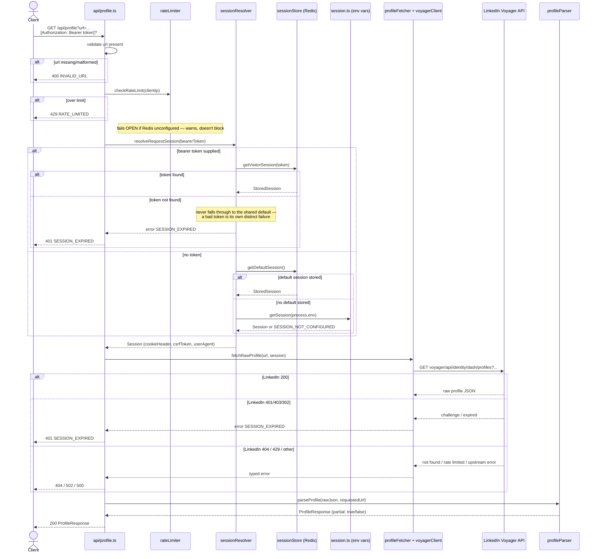
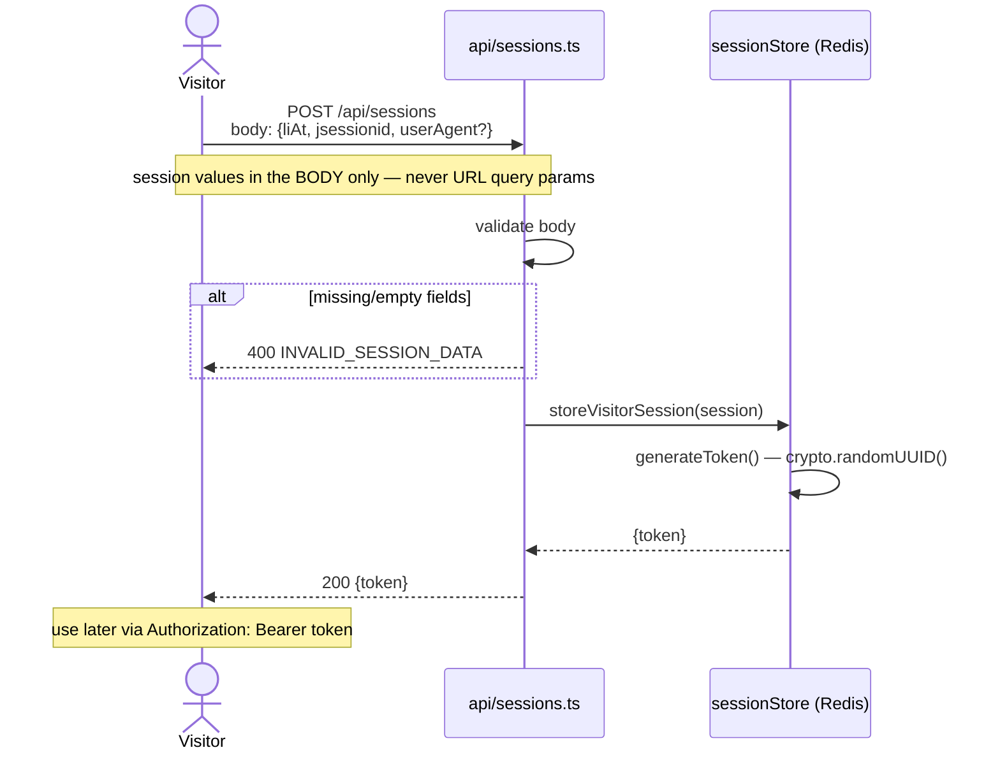
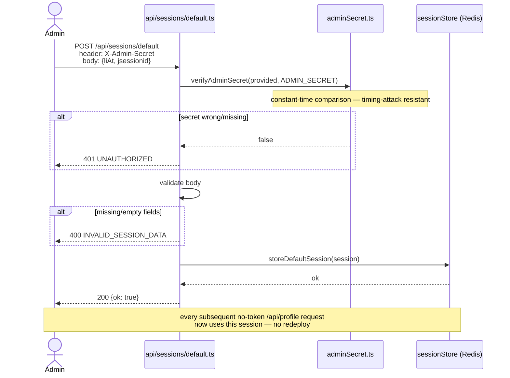

# Architecture

This documents how the LinkedIn Profile API is put together — the request pipeline, module boundaries, and the session-resolution logic that spans Phase 1 and Phase 3. For setup and API usage, see [README.md](README.md); for the full design rationale and decision history, see [docs/specs/linkedin-profile-api.md](docs/specs/linkedin-profile-api.md).

## System overview

**The one rule that shapes everything:** raw LinkedIn access (`voyagerClient.ts`, `profileFetcher.ts`) and response shaping (`profileParser.ts`, highlighted above) are strictly separate layers. LinkedIn's internal API is undocumented and drifts over time — keeping these separate means a shape change only ever breaks the parser, never the fetch/auth logic.

## Request flow: `GET /api/profile`

This is the core pipeline, and the one place Phase 1 and Phase 3 meet: session resolution now has three tiers instead of one.

**Session priority, in one line:** a visitor's own bearer token &gt; the shared Redis-stored default &gt; the original `LI_AT_COOKIE`/`LI_JSESSIONID` env vars. Each tier is only consulted if the one before it isn't available — this is `resolveSessionSource()` in `sessionStore.ts`, the one pure, unit-tested decision in the whole session-handling layer. Everything else touching a session depends on live external state (a real LinkedIn session, a real Redis instance) and is verified with the `scripts/*.ts` standalone scripts instead of automated tests.

## Request flow: bring-your-own-session (Phase 3)

## Module responsibilities

| Module | Responsibility | Depends on |
|---|---|---|
| `api/profile.ts` | Orchestrates one request: validate → rate limit → resolve session → fetch → parse → respond | Everything below |
| `src/linkedin/sessionResolver.ts` | Three-tier session priority (token → default → env) | `session.ts`, `sessionStore.ts` |
| `src/linkedin/session.ts` | `buildSession()` — pure: raw values → `Session`; `getSession()` — env vars → `Session`, unchanged since Phase 1 | — |
| `src/sessions/sessionStore.ts` | Redis-backed session storage (token-keyed + reserved `"default"` key); `resolveSessionSource()` — the one pure TDD seam | `redisClient.ts` |
| `src/linkedin/identifiers.ts` | Pure: `linkedin.com/in/{slug}` URL → identifier, or `INVALID_URL` | — |
| `src/linkedin/voyagerClient.ts` | Raw HTTP to LinkedIn's Voyager API; classifies the response into typed success/error | `session.ts` (types only) |
| `src/linkedin/profileFetcher.ts` | Composes `identifiers.ts` + `voyagerClient.ts` | Both |
| `src/linkedin/profileParser.ts` | Pure: raw undocumented JSON → `ProfileResponse`. Primary test seam — TDD'd against real captured fixtures | — |
| `src/rateLimit/rateLimiter.ts` | Per-IP sliding-window limit via Upstash; fails open if unconfigured | `redisClient.ts` |
| `src/cache/redisClient.ts` | Shared Upstash Redis client, returns `null` if unconfigured rather than throwing | — |
| `src/utils/errors.ts` | `ApiErrorCode` → HTTP status map, envelope builder | — |
| `src/utils/ip.ts` | Pure: extracts client IP from headers/socket | — |
| `src/utils/adminSecret.ts` | Pure: constant-time secret comparison | — |
| `src/types/profile.ts` | The `ProfileResponse`/`ApiErrorResponse` contract | — |
| `src/types/linkedin-raw.ts` | Loose types for LinkedIn's raw JSON, only the fields actually consumed | — |

## Testing strategy

Per `docs/specs/linkedin-profile-api.md`'s Testing Decisions: test external behavior at the highest-value seam; verify anything touching live external state (a real LinkedIn session, a real Redis instance) with standalone scripts instead of mocks that would only prove the mock works.

| Seam | How it's tested |
|---|---|
| `profileParser.ts` | TDD, real captured LinkedIn JSON fixtures — the primary seam, since this is what LinkedIn's drift actually breaks |
| `identifiers.ts` | TDD, valid/invalid URL shapes |
| `sessionStore.ts`'s `resolveSessionSource()` | TDD, all 4 meaningful flag combinations — the one pure decision Phase 3 introduces |
| Everything else (session, live fetch, Redis, rate limiting, both new endpoints end-to-end) | `scripts/*.ts`, run against the real services |

## Error handling

Every failure mode returns `{ error: { code, message } }` with a status from the same map (`src/utils/errors.ts`) — see the README's API section for the full code table. The two Phase 3 additions (`INVALID_SESSION_DATA`, `UNAUTHORIZED`) follow the same pattern rather than overloading an existing code with a misleading meaning.

## Known architectural limitations

See the README's [Known Limitations](README.md#known-limitations) section for the full list (session expiry frequency, plaintext-in-Redis, private-vs-not-found ambiguity, etc.) — kept in one place rather than duplicated here.
